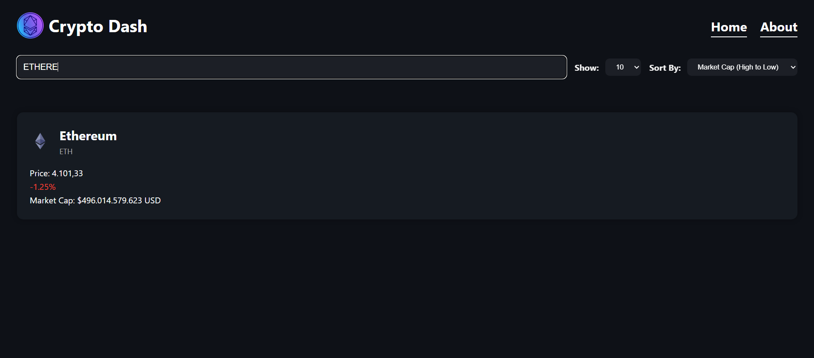

# React + Vite Crypto Dash App

Used <a href="https://www.coingecko.com/tr/api">CoinGecko API</a> in this project.

# Features

You can <strong>search</strong> coin:

<strong>Sorting</strong> coins:

<strong>Selecting</strong> how many coins to list:

